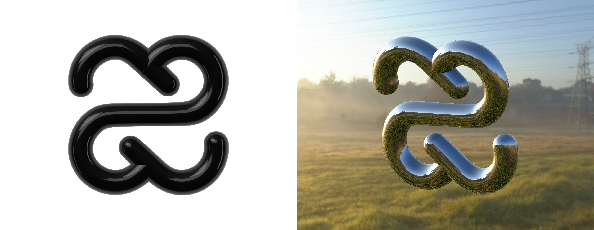

# crafter-knot



The Crafter Station mark as real 3D tubes, rendered on WebGPU with [vgpu](https://vgpu.sh) as the
only rendering dependency. Every stroke keeps the mark's exact path, weight, gaps and joins, swept
into tubes you can shape, texture, finish and light from a drawer, then export as a PNG.

| Input                     | Does                                    |
| ------------------------- | --------------------------------------- |
| Drag, mouse or one finger | Turn it                                 |
| Scroll, trackpad pinch    | Zoom                                    |
| Handle on the right edge  | Opens the look drawer                   |
| `?turn=yaw,pitch`         | Starts at a pose in degrees, for stills |

The drawer has nine finishes (Lacquer, Chrome, Gold, Porcelain, Rubber, Candy, Pearl, Neon,
Carbon) and every setting behind them: material, texture, shape, scene, light, camera and export.
The whole state is live JSON at the bottom: copy it, paste it, or edit it in place. It is kept
between visits, and **Reset** returns to the default.

```bash
npm install
npm run dev
npm run build
```

Needs a browser with WebGPU: current Chrome, Edge and Safari 26 on desktop, Safari on iOS 26,
Chrome on Android. Without it the page shows the mark as an SVG and says so.

## How it works

- `scripts/fit.ts` recovers the tubes behind the mark's filled outline: two B-spline strokes with
  a varying radius, cut at the gaps, written to `src/knot/strands.ts`.
- `src/knot/tube.ts` sweeps them into a watertight mesh in a worker, with baked contact shadows
  and surface coordinates for the patterns.
- `src/render/` draws the tubes into an MSAA HDR target, adds bloom, and presents through the
  F-6800 film LUT with dithering. Everything is a vgpu `draw()` or `effect()` in one `frame()`.
- Two lights: the black studio from [v-prism](https://github.com/crafter-station/v-prism), an
  analytic dome with three panels, and the Spruit Sunrise UltraHDR panorama from the three.js
  examples, decoded and prefiltered on the GPU the first time it is chosen.

## Credits

The studio, film grade and page chrome come from
[v-prism](https://github.com/crafter-station/v-prism); the LUT is from the pmndrs
[`nextjs-prism`](https://github.com/pmndrs/examples/tree/main/examples/nextjs-prism) example
(MIT). The sunrise is [Spruit Sunrise](https://polyhaven.com/a/spruit_sunrise) from Poly Haven
(CC0), in the UltraHDR conversion shipped with the three.js examples.
