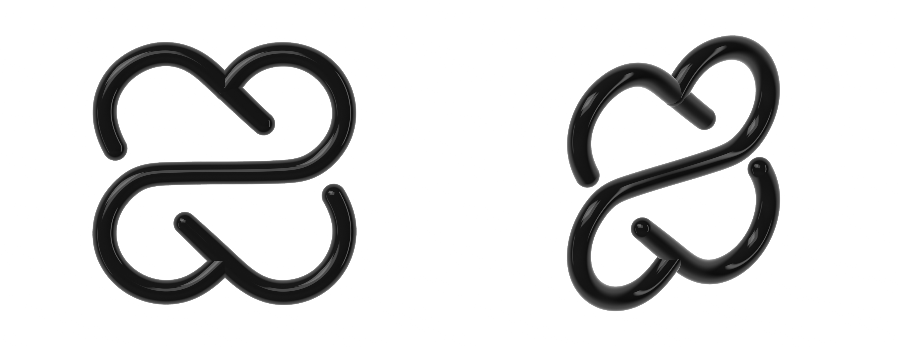

# crafter-knot



The Crafter Station mark as real 3D tubes, like three.js's `TorusKnotGeometry`, rendered on WebGPU
with [vgpu](https://vgpu.sh). Every stroke keeps the mark's exact path, weight, gaps and joins, and is
swept into a round tube with a black lacquer finish, from the first frame and at every angle.

| Input                     | Does                                                         |
| ------------------------- | ------------------------------------------------------------ |
| Drag, mouse or one finger | Turn it; let go and it drifts, then springs back to face you |
| `?turn=yaw,pitch`         | Pins a pose in degrees, for stills                           |
| `?still`                  | Skips the intro swing                                        |

```bash
npm install
npm run dev
npm run build && npm run preview
npm run fit   # refits the tubes to src/knot/mark.svg (needs Bun)
```

Needs WebGPU: current Chrome, Edge and Safari 26. Without it the page shows the SVG mark.

## From outline to tubes

The SVG is one filled outline (42 Bézier segments), not a stroke, so `scripts/fit.ts` recovers the
tubes behind it and writes `src/knot/strands.ts`:

1. **Label the outline.** Each segment is a side of one of two strokes or one of the four rounded
   ends. The weight is not constant: about 24.2 units on the lobes, 23.3 on the diagonals and 22.8
   on the bar (in the 257-unit box).
2. **Two strokes.** The **loop** runs through both lobes and diagonals and is fitted as one closed
   curve, so it stays smooth across the gaps. The **bridge** runs from the top-right lobe along the
   bar to the bottom-left lobe, and both of its ends finish inside the loop where the mark joins
   them.
3. **Fit.** Each stroke is a uniform cubic B-spline in (x, y, z, radius): 40 knots for the loop, 38 for
   the bridge. The centre line comes from squared-distance minimisation against the outline offset
   inwards, with a bending penalty. The radius comes from a second least-squares pass, so the tubes
   keep the mark's changing weight. Edge error: 0.12 units rms (0.68 max) on the loop and 0.08
   (0.44) on the bridge.
4. **Gaps.** The loop is cut where the mark leaves a gap, so it becomes two open pieces whose
   rounded ends land on the mark's own ends. All three tubes lie in one plane; nothing crosses.
5. **Sweep.** `src/knot/tube.ts` builds rotation-minimising frames (double reflection), emits 64
   sides per ring every 0.012 units with normals that follow the changing radius, and closes each
   end with a hemisphere. `src/knot/occlusion.ts` bakes contact shadows per vertex where tubes meet.

## How it renders

| Pass    | Target                              | Draws                                                                                                                |
| ------- | ----------------------------------- | -------------------------------------------------------------------------------------------------------------------- |
| Knot    | `lit` (rgba16float, 4x MSAA, depth) | the tubes in black lacquer: Fresnel 0.045 over analytic studio softboxes and a white backdrop, baked contact shadows |
| Present | canvas                              | composited over white in sRGB, soft shoulder above 0.7, dithering                                                    |

```
scripts/fit.ts        mark.svg outline to strands.ts
src/knot/             mark, spline, strands (generated), tube sweep, occlusion
src/render/           renderer, camera, shaders (knot, studio, present)
src/interaction/      pose (inertia, spring back), pointer
src/poster.ts         the SVG shown without WebGPU
```
